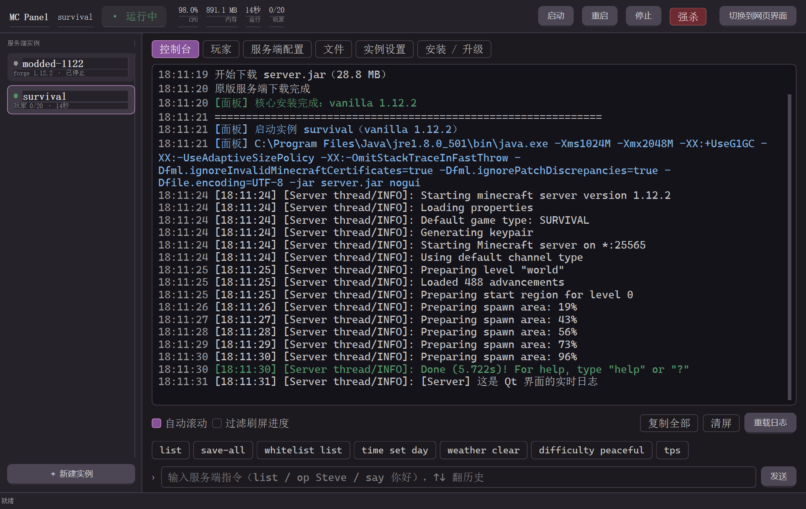

# MC Panel · Minecraft 面板开服器


纯 Python 标准库实现的 Minecraft 服务端管理面板：**核心部分零第三方依赖**。
一个 `python panel.py`（或双击 `mc-panel.exe`）就能跑起来，在浏览器/桌面窗口里完成
下载核心、开服、看日志、发指令、改配置、管文件。

另外还提供**原生 Qt 界面**（基于 [PyQt-SiliconUI](https://github.com/ChinaIceF/PyQt-SiliconUI)），
需要在当前 Python 环境里装上 PyQt5 + siui 后才会自动启用。

```
┌──────────────┐   HTTP    ┌───────────────────────────────┐  stdin/stdout  ┌──────────┐
│  Qt / 浏览器  │ ────────▶ │ panel.py + mcpanel（本机进程）  │ ─────────────▶ │ java 服务端│
└──────────────┘           └───────────────────────────────┘                └──────────┘
```

## QT版使用到的依赖https://github.com/ChinaIceF/PyQt-SiliconUI


## 界面预览

| 控制台（实时日志 + 指令） | 服务端配置（中文分组表单） |
| --- | --- |
|  |  |




> 截图里的 `survival` 实例是测试用的演示服，实际使用时从「＋ 新建实例」开始。
>
> 桌面窗口版、浏览器版、Qt 版用的是**同一套后端逻辑**。上面前几张是用无头浏览器抓的页面截图；
> Qt 版截图来自真实的 PyQt-SiliconUI 窗口渲染。
>
> 桌面窗口版走 WebView2 合成，在虚拟机 / 远程桌面等环境下抓屏可能只能拿到窗口背景色，
> 请以实际窗口效果为准。

## 界面形态

MC Panel 提供**四种界面形态**，按依赖从高到低排列。
只要环境允许，默认会自动用最好的那一档；环境不够就顺滑降级，绝不会因为缺某个依赖就启动失败。

```bash
python panel.py              # 自动选：Qt 界面（可选）→ WebView2 窗口 → 浏览器窗口 → 浏览器标签页
python panel.py --qt         # 强制用 Qt 界面（环境不够时报错）
python panel.py --web        # 强制走网页前端（pywebview / 浏览器）
python panel.py --app        # 无地址栏的浏览器窗口（不需要 pywebview / siui）
python panel.py --browser    # 普通浏览器标签页
python panel.py --no-browser # 只跑 HTTP 服务，不开界面（当后台服务用）
```

| 档位 | 依赖 | 效果 |
| --- | --- | --- |
| **Qt 界面** | PyQt5 + PyQt-SiliconUI + numpy | 原生 Qt 窗口，内置「切换到网页界面」按钮 |
| **WebView2 窗口** | pywebview + WebView2 运行时 | 原生窗口，无地址栏，外观与网页一致 |
| **浏览器窗口** | 本机装有 Edge / Chrome | 无地址栏的独立窗口（`--app` 模式） |
| **浏览器标签页** | 无 | 普通网页，兼容任何设备 |

**发 EXE 的时候选哪个？** 三个打包产物的依赖情况不一样：

| EXE | 目标机器需要什么 | 适合谁 |
| --- | --- | --- |
| `mc-panel-qt.exe` | **什么都不用装**（除 Java） | 拿不准 / 服务器 / 精简系统 —— 首选 |
| `mc-panel.exe` | WebView2 运行时 | 已经装了 WebView2 的普通 Win10/Win11 |
| `mc-panel-console.exe` | 一个浏览器 | 只用网页版、或当后台服务跑 |

`mc-panel-qt.exe` 是唯一**零运行时依赖**的那一个：PyQt5 和界面主题都打在包里，
不碰 WebView2、不碰浏览器、不依赖 .NET，也不会遇到「渲染内核被降级」那类问题
（Windows Server 2019 默认没装 WebView2，用 `mc-panel.exe` 会掉进那个坑）。
唯一的外部依赖是 **Java** —— 那是跑 Minecraft 服务端本身要用的，跟界面无关。

- 关闭窗口时如果还有服务端在跑，会弹原生对话框问你要不要一并停掉
- 加 `--stop-all-on-exit` 则直接停掉、不再询问
- **窗口一片空白**（虚拟机 / 远程桌面 / 老显卡驱动常见）：加 `--software-render` 强制软件渲染
- **界面出来了但没有样式、按钮全点不动**：少了 WebView2 运行时，见下面「常见问题」第一条

## 快速开始

```bash
python panel.py            # 启动面板（自动选 Qt → WebView2 → 浏览器），默认端口 8080
python panel.py --qt       # 强制用 Qt 界面
```

Windows 直接双击 `run.bat`（网页界面）或 `run_qt.bat`（Qt 界面）。
Linux/macOS 用 `./run.sh`。
打包后的 `mc-panel.exe` 双击即可，目标机器不用装 Python；
想用 Qt 原生窗口就双击 `mc-panel-qt.exe`。

首次启动会打印环境自检结果（检测到哪些 Java、端口是否可用、界面用哪一档）。想单独看自检：

```bash
python panel.py --check
```

## 命令行参数

| 参数 | 说明 |
| --- | --- |
| `--qt` | 强制使用 Qt 界面（需要 PyQt5 + siui + numpy） |
| `--web` | 强制使用网页界面 |
| `--host 0.0.0.0` | 监听地址。默认 `127.0.0.1` 仅本机；想让朋友通过局域网访问面板就改成 `0.0.0.0` |
| `--port 9000` | 面板端口，默认 `8080`，被占用时会自动顺延 |
| `--password 密码` | 面板登录密码。**监听非本机地址时强烈建议设置** |
| `--servers-dir D:\mc` | 实例存放目录，默认程序目录下的 `servers/` |
| `--no-browser` | 启动后不自动打开浏览器 |
| `--browser` | 用系统浏览器打开面板 |
| `--app` | 使用无边框浏览器窗口 |
| `--desktop` | 使用 WebView2 原生窗口 |
| `--software-render` | 强制软件渲染，解决窗口空白问题 |
| `--stop-all-on-exit` | 退出面板时把所有正在运行的服务端一起停掉 |
| `--check` | 只做环境自检，不启动面板 |

> 面板只管「进程」不常驻。关掉面板窗口后，已经在跑的服务端**依然在后台运行**；
> 下次打开面板会自动重新接管它（状态、日志、进程都还在）。不想要这种行为就加 `--stop-all-on-exit`。

## 能做什么

**开服**
- 支持核心：`Vanilla` / `Paper` / `Purpur` / `Fabric` / `Forge`（含 1.12.2 等经典版）/ `Spigot`（BuildTools 现场编译）/ 自定义 jar
- 自动下载核心、自动渲染进度、自动识别启动入口（`-jar` 或 Forge 1.17+ 的 `args.txt`）
- 按游戏版本自动选择 Java（1.16.5 及以下 → Java 8，1.17~1.20.4 → Java 17，1.20.5+ → Java 21）
- 自动写 `eula.txt`、自动生成 `server.properties` 初始模板

**运行管理**
- 多实例并存，侧边栏实时状态（CPU / 内存 / 运行时长 / 在线玩家）
- 启动 / 停止 / 重启 / 强杀；停止时先发 `stop` 让服务端存档，超时才强杀
- 进程异常退出可选自动重启

**控制台**
- 实时日志（自动识别 INFO / WARN / ERROR 着色）、按行时间戳
- 指令输入框 + ↑↓ 历史，常用指令一键发送
- 控制台日志同时落盘到 `servers/<实例>/logs/panel-latest.log`（每次启动滚动归档）
- `Preparing spawn area: 19%` 这类刷屏进度会原地刷新，不会刷爆日志

**配置与文件**
- `server.properties` 中文分组表单（每组只显示相关项，未知字段也不会丢）
- 内置文件管理器：浏览、在线编辑 `properties/yml/json/txt/conf/log`、上传、下载、新建目录、删除
- 引擎/运行参数调整：内存上下限、JVM 参数（内置 1.12.2 与 Aikar's Flags 预设）、服务端参数、停机等待时长

## 目录结构

```
mc-panel/
├─ panel.py                # 入口：参数解析、环境自检、信号处理
├─ run.bat / run.sh        # 双击启动脚本（网页界面）
├─ run_qt.bat               # 双击启动脚本（Qt 界面，需要 PyQt5 + siui）
├─ build_exe.bat           # 一键打包 exe（推荐）
├─ build_exe.py            # 打包脚本主体（PyInstaller + 自动验证）
├─ build_zip.bat / .py     # 打包源码 zip（自动收录 + 解压试跑校验）
├─ make_icon.py            # 生成 app.ico（纯标准库画图标）
├─ app.ico                 # 应用图标
├─ .buildenv/              # 打包用的隔离 Python 环境（自动生成，可删）
├─ panel.json              # 面板自身配置（首次运行自动生成）
├─ servers/                # 所有实例的家目录
│  └─ <实例名>/
│     ├─ instance.json     # 该实例的面板配置
│     ├─ server.properties
│     ├─ logs/panel-latest.log
│     └─ world/ plugins/ mods/ ...
└─ mcpanel/
   ├─ config.py            # 面板配置读写
   ├─ desktop.py           # 桌面窗口外壳（WebView2 原生窗口 + 三级降级）
   ├─ java.py              # 本机 Java 探测与版本推荐
   ├─ instance.py          # 实例进程管理 / 日志解析 / 文件操作
   ├─ downloader.py        # 各核心的版本查询与下载安装
   ├─ properties.py        # server.properties 解析 + 中文字段表
   ├─ procstat.py          # 跨平台 CPU/内存采集（纯标准库）
   ├─ qtui/                # Qt 界面（可选，PyQt5 + PyQt-SiliconUI）
   │  ├─ __init__.py       # 检测与入口
   │  ├─ theme.py          # siui 主题适配 / 通用工具
   │  ├─ pages.py          # 六个页面（控制台/玩家/配置/文件/设置/安装）
   │  └─ window.py         # 主窗口与 Qt 事件循环
   ├─ util.py              # 编码、路径安全、JSON 原子写、运行形态判定
   ├─ web.py               # 内置 HTTP 服务 + REST API
   └─ static/              # 面板前端（原生 JS，无框架）
```

## 打包分发

### 打包 EXE（目标机器不用装 Python）

**最省事：双击 `build_exe.bat`**

脚本会自动跑完 6 步，首次约 2~4 分钟：

```
[1/6] 找到 Python        → [2/6] 准备独立环境 .buildenv → [3/6] 装 PyInstaller
[4/6] 检查 pywebview      → [5/6] 生成图标 app.ico        → [6/6] 打包 + 自动验证
```

会打出**两个 exe**，按需取用：

| 产物 | 体积 | 说明 |
| --- | --- | --- |
| `dist/mc-panel.exe` | ~13 MB | **桌面窗口版**：原生窗口，双击就是一个应用（需要 pywebview） |
| `dist/mc-panel-console.exe` | ~10 MB | **控制台版**：终端 + 浏览器界面，零额外依赖 |

如果你想**连 Qt 界面版一起打**，需要先装好 Qt 依赖，再执行：

```bat
.buildenv\Scripts\python.exe -m pip install pyinstaller pywebview
.buildenv\Scripts\python.exe -m pip install PyQt5 numpy "E:\SRC\PyQt-SiliconUI"
.buildenv\Scripts\python.exe build_exe.py --mode qt
```

| 产物 | 体积 | 说明 |
| --- | --- | --- |
| `dist/mc-panel-qt.exe` | ~72 MB | **Qt 界面版**：原生 Qt 窗口，不用浏览器 |

> 发给别人（尤其是服务器）优先给 `mc-panel-qt.exe` —— 它是唯一零运行时依赖的，
> 目标机器除了 Java 什么都不用装。

> `.buildenv` 是脚本自建的隔离打包环境（约 50 MB，已加进 `.gitignore`），
> 不会污染你系统里的 Python。删掉它也没事，下次会自动重建。

**手动方式**（等价于上面的脚本，适合塞进 CI）

```bat
python -m venv .buildenv
.buildenv\Scripts\python.exe -m pip install pyinstaller pywebview
.buildenv\Scripts\python.exe make_icon.py      :: 生成 app.ico（只需一次）
.buildenv\Scripts\python.exe build_exe.py      :: 默认两个版本都打
.buildenv\Scripts\python.exe build_exe.py --mode console     :: 只打控制台版
.buildenv\Scripts\python.exe build_exe.py --mode qt          :: 打 Qt 界面版（需要先装 PyQt5 + siui）
.buildenv\Scripts\python.exe build_exe.py --verify-only     :: 不重打，只校验已有 exe
.buildenv\Scripts\python.exe build_exe.py --full             :: 完整重建（清缓存）
```

打 Qt 版需要先让当前 Python 能 `import siui`：

```bat
.buildenv\Scripts\python.exe -m pip install PyQt5 numpy
.buildenv\Scripts\python.exe -m pip install "E:\SRC\PyQt-SiliconUI"
.buildenv\Scripts\python.exe build_exe.py --mode qt
```

> 注意：siui 没有自带 PyInstaller 钩子，`build_exe.py` 会动态定位并打进
> `siui/gui/icons/packages` 目录下的图标包。自己手动打包的话容易漏这一步。

Qt 界面版同样会**真打开一次窗口**，并且通过抓图统计颜色种类来确认界面确实渲染出来了：

```
✓ Qt 窗口已打开               UI_QT_MODE window=1360x860
✓ 界面已渲染                  UI_QT_RENDER w=2040 h=1290 colors=92
✓ 窗口正常退出                 退出干净
```

### 把 exe 发给别人用

**结论：可以，目标机器不需要装 Python、PyQt5、siui 中任何一个。**

exe 是完全自包含的（实测解压后 1676 个文件），里面已经带了：

| 内容 | 说明 |
| --- | --- |
| Python 3.13 解释器 | 不需要目标机器装 Python |
| PyQt5 5.15（Qt5Core/Gui/Widgets 等 DLL） | 不需要装 Qt |
| Qt 平台插件 `qwindows.dll` | 缺了它窗口起不来 |
| siui + 图标包（3 个 `.icons`，7.3 MB） | 缺了它 `import siui` 直接崩 |
| numpy | siui 的核心依赖 |
| VC++ 运行库 `VCRUNTIME140.dll` + UCRT | **不需要**装 VC++ Redistributable |
| 面板前端资源（html/js/css） | 网页界面离线可用 |

已在"清空所有环境变量、PATH 只留系统目录"的模拟环境下实测通过：
窗口打开正常、界面渲染出 92 种颜色、接口全通、退出码 0。

**但有一件事必须自己装：Java。**

Minecraft 服务端本身就是 Java 程序，面板只是管理它。没有 Java 就开不了服 ——
面板启动时会检测并明确提示（1.12.2 及以下装 Java 8，1.17~1.20.4 装 Java 17，
1.20.5 及以后装 Java 21），也可以在「实例设置」里手动填 `java.exe` 路径。

其他注意事项：

- **系统要求**：64 位 Windows（exe 是 x64），Qt 5.15 支持 Windows 7 及以上，推荐 Win10/11
- **别放 `C:\Program Files`**：那里没有写权限，面板会在自检时明确提示
- **整个目录一起拷**：`panel.json` 和 `servers/` 生成在 exe 旁边，搬走目录 = 搬走服务器数据
- **可能被杀软误报**：PyInstaller 单文件 exe 是"自解压"程序，这是打包方式的通病。
  源码全在 `-src.zip` 里可自行审查，也可以用 `python panel.py` 源码方式跑
- **首次启动有 1~2 秒延迟**：exe 要把自己解压到临时目录，正常现象
- **Qt 版和桌面窗口版都是 GUI 子系统**，双击不会闪黑框；
  需要看日志就用 `mc-panel-console.exe`（控制台版），或看 exe 旁边的 `panel-gui.log`

### 打包报错排查

| 现象 | 原因与处理 |
| --- | --- |
| `[错误] 没有找到 Python` | 装 Python 3.8+ 并勾选 "Add python.exe to PATH" |
| PyInstaller / pywebview 安装失败 | 网络问题，挂代理或换国内镜像后重试 |
| `Unable to find ... when adding binary and data files` | `--add-data` 的相对源路径按 `--specpath` 解析，必须写成绝对路径（`build_exe.py` 已处理） |
| `xxx.exe 正被占用，无法覆盖` | 有该程序在运行，先关掉再重新打包 |
| 打包成功但双击白屏 | 前端静态资源没进包。用 `build_exe.py` 打，它会真启动 exe 校验静态资源 |
| Qt 版 exe 双击后没窗口，只有日志 | 缺少 PyQt5 / siui / numpy；装好后重新打包 `--mode qt` |
| Qt 版 exe 报错 `No module named 'siui'` | `.buildenv` 里没有 siui，按上面手动方式安装后再打包 |
| Qt 版 exe 报错 `FileNotFoundError: ... siui\gui\icons\packages` | siui 图标资源没打进去；确保用 `build_exe.py --mode qt`，它自动收集 |
| exe 自检时打印 `✓` 崩掉 | 中文控制台是 GBK 编码，需 `SetConsoleOutputCP(65001)` + 流 `reconfigure`（`panel.py` 的 `setup_console()` 已处理） |
| 用户反馈"服务器全没了" | 数据目录指到了 `_MEIPASS` 临时目录。必须用 `app_root()` 取 exe 所在目录 |
| 改了 `.bat` 后双击就闪退 | Windows 的 `.bat` 必须用 **CRLF** 换行，用 LF 会导致多行 `if (...)` 块解析错乱 |
| 构建报 `conflicting option string` | 参数被重复定义，检查 `parse_args` 有没有同名的 `add_argument` |
| 构建报 `already imported as ExcludedModule` | 别把 `distutils` 放进 `--exclude-module`，PyInstaller 的 hook 会别名它 |

### 打包源码 zip

**最省事：双击 `build_zip.bat`**（源码打包只用标准库 `zipfile`，不需要虚拟环境、不用装任何东西）

```bash
python build_zip.py                 # 打包 + 自动校验，约 10 秒
python build_zip.py --list          # 只看会打进去哪些文件，不打包
python build_zip.py --no-verify     # 跳过校验（快，但别这么发版）
python build_zip.py --out D:\x.zip  # 指定输出路径
```

产物是上级目录下的 `mc-panel-v<版本>-src.zip`（约 580 KB）。

两个设计要点：

1. **默认自动收录**整个项目，靠排除规则把不该进包的东西挡掉 ——
   以后新增源码/文档**不用改脚本**，不会漏打。排除项：
   `__pycache__`、`.buildenv/`、`build/`、`dist/`、`servers/`、`.webview/`、
   `panel.json`、`*.log`、`*.exe/dll/zip`、IDE 目录等。

2. **打完会解压到临时目录真跑一次 `panel.py --check`** ——
   确认发出去的源码是能跑的，而不是"文件都在但一 import 就炸"：

```
校验压缩包
  ✓ 必备文件          21/21
  ✓ CRC 完整性        全部通过
  ✓ 未混入运行期产物   干净
  ✓ 未混入二进制       干净
  ✓ 体积             原始 1062.2 KB -> 压缩后 578.1 KB（29 个文件）
  ✓ 解压后能运行      panel.py --check 退出码 0
```

同理，`build_exe.py` 打完也会把 exe 真跑起来验证（见上一节）。

### 发新版本

版本号**只有一个来源**：`mcpanel/__init__.py` 里的 `__version__`。
两个打包脚本都从那里读，所以发版只需三步：

```bash
# 1. 改版本号（改这一处即可，exe 属性、zip 文件名、面板页脚都会跟着变）
#    mcpanel/__init__.py:  __version__ = "1.1.0"

# 2. 打 exe（会写进 Windows 文件属性）
build_exe.bat

# 3. 打源码包
build_zip.bat
```

拿到的就是 `dist/mc-panel.exe`、`dist/mc-panel-console.exe`、`../mc-panel-v1.1.0-src.zip`。

## 常见问题

**界面能打开，但是白底黑字、没有样式，所有按钮点了都没反应**（Windows Server 2019/2022、精简版系统高发）

这台机器没装 **Microsoft Edge WebView2 运行时**。

pywebview 只有在「.NET ≥ 4.6.2 **且** 装了 WebView2 运行时」时才会用 Chromium 内核渲染，
条件不满足它会**静默退回 MSHTML** —— 也就是 IE11 的 Trident 内核。那个内核上：

- `var(--x)` 这类 CSS 变量不支持 → 整套深色主题失效，`body{background:var(--bg)}` 变成默认白底
- flex 的 `gap`、`display:grid` 不支持 → 控件全挤在一起
- 前端 JS 用的是 `const` / 箭头函数 / `async` / `fetch` → 第一行就语法报错，整页逻辑全死

于是就成了「窗口是开着的，但看起来像个半成品，功能全用不了」。

> 注意：**在浏览器里打开同一个地址是正常的**，那不是同一个渲染内核，
> 所以"网页版好的"完全不能说明这个窗口是好的。

和「窗口一片空白」是两回事：那个是渲染管线问题，加 `--software-render` 就行；
这个是内核被降级了，必须换内核。

修复（任选一种，第 1 种最省事）：

1. **换 `mc-panel-qt.exe`** —— 它是零运行时依赖的，根本不碰 WebView2 这套东西，
   拷过去双击就能用。服务器、拿不准的机器直接用它最省心。
2. 装 WebView2 运行时，一次装好永久有效：
   <https://developer.microsoft.com/microsoft-edge/webview2/>
   选 **Evergreen Standalone Installer** 的 x64 版，装完重启面板即可。
3. 本机有 Edge / Chrome 的话，直接绕过 pywebview：
   `mc-panel.exe --app`（无地址栏的独立窗口，效果和 WebView2 窗口基本一致）
4. 只想在浏览器里用：`mc-panel.exe --browser`

不确定自己属于哪种情况，先跑一次自检，它会直接指出缺哪一项：

```bash
mc-panel.exe --check
```

**提示找不到 Java / 服务端启动秒退**
在「实例设置」里手动指定 `java.exe` 的完整路径。注意版本要对：
1.12.2 这类老版本必须用 **Java 8**，用高版本会报
`Unsupported class file major version` 或直接闪退。

**Forge 安装很慢**
Forge 安装器要联网拉几百个依赖库，1.12.2 大约 1~3 分钟、新版更久，控制台能看到 `[installer]` 开头的实时日志。

**Spigot 编译失败**
BuildTools 依赖 `git`，请先安装 Git 并确保在 PATH 里。编译过程 5~20 分钟，属于正常现象。

**换端口**
改 `server.properties` 里的 `server-port` 后重启服务端；面板只负责显示。

**exe 被杀毒软件拦截 / 提示"未知发布者"**
PyInstaller 打出来的单文件 exe 属于"自解压式"程序，360、火绒、Defender 经常误报。
这是打包方式的通病，不是程序有问题（源码全部在仓库里，可自行审查和重新打包）。
添加信任即可；介意的话就用源码方式运行。

**exe 双击闪一下就没了 / 提示没有权限写文件**
说明放到了没有写权限的目录（比如 `C:\Program Files`）。挪到桌面或 D 盘再试。

**面板要不要设密码？**
只要 `--host` 不是 `127.0.0.1`，就一定要设。面板能执行任意服务端指令、读写实例目录文件。

## 安全说明

- 默认只监听 `127.0.0.1`，不对局域网暴露
- 设置密码后所有 `/api/*` 接口都需要登录 cookie
- 文件管理接口做了路径穿越校验，无法逃出实例目录
- 面板不联网上报、不收集任何数据；仅在你主动下载核心时访问 Mojang / PaperMC / Purpur / Fabric / Forge 官方接口

许可证
MC-Server-Launcher 使用 GPLv3 许可证

版权所有 由 zhebushigudu 创作

特别声明
用户阅读、下载、基于该软件开发或修改该软件，即代表用户已经理解并同意开源许可证声明的权利与限制，用户理解并同意不进行违反当地法律法规的开发或/和修改，若因用户的开发或/和修改违反了当地的法律，或是用户的开发或/和修改的传播和使用过程中违反了传播者和使用者所在地区适用的法律，或是造成了任何负面的个人或公众影响，用户应承担全部责任，本软件的开发者不承担任何责任。
