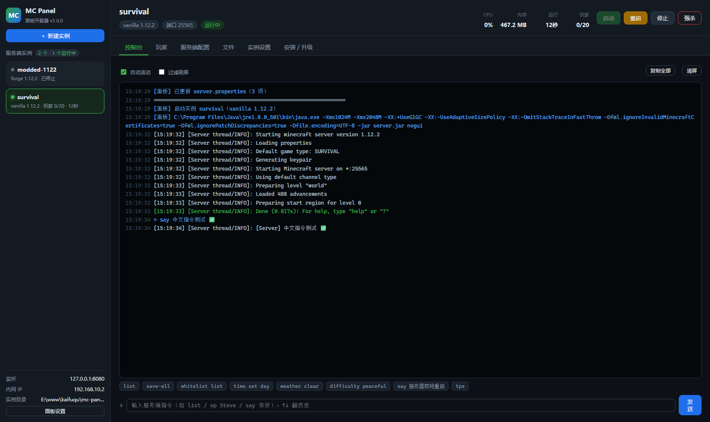
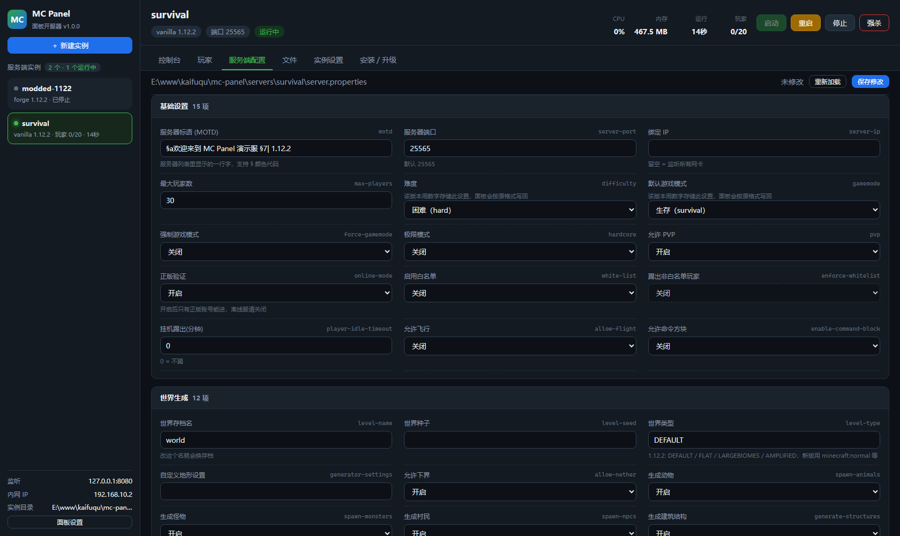
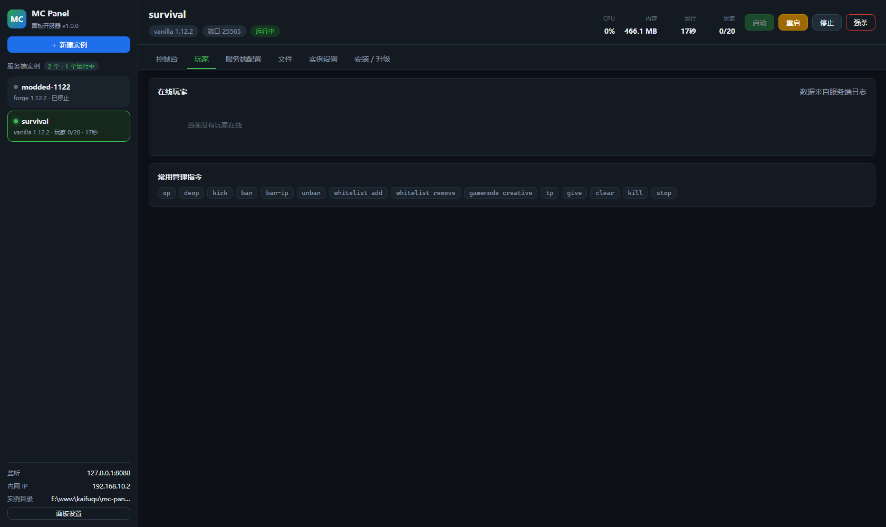

# MC Panel · Minecraft 面板开服器


纯 Python 标准库实现的 Minecraft 服务端管理面板：**零第三方依赖**，一个 `python panel.py`
（或双击 `mc-panel.exe`）就能跑起来，浏览器里的可视化面板负责下载核心、开服、看日志、
发指令、改配置、管文件。

```
┌──────────────┐   HTTP    ┌───────────────────────────────┐  stdin/stdout  ┌──────────┐
│  浏览器面板   │ ────────▶ │ panel.py + mcpanel（本机进程）  │ ─────────────▶ │ java 服务端│
└──────────────┘           └───────────────────────────────┘                └──────────┘
```

## 界面预览

| 控制台（实时日志 + 指令） | 服务端配置（中文分组表单） |
| --- | --- |
|  |  |



> 截图里的 `survival` 实例是测试用的演示服，实际使用时从「＋ 新建实例」开始。
>
> 桌面窗口版和浏览器版用的是**同一套界面**。上面这几张是用无头浏览器抓的页面截图 ——
> WebView2 的窗口内容走 DirectComposition 合成，在虚拟机 / 远程桌面等环境下
> 抓屏只能拿到窗口背景色，所以窗口版的视觉效果请以实际运行为准。

## 界面形态

默认是**桌面窗口模式**：一个原生窗口（WebView2），没有地址栏、没有标签页，
任务栏图标和窗口标题都是 MC Panel 自己的，双击 exe 就是一个应用。

```bash
python panel.py                  # 桌面窗口（推荐）
python panel.py --app            # 无地址栏的浏览器窗口（不需要 pywebview）
python panel.py --browser        # 普通浏览器标签页
python panel.py --no-browser     # 只跑 HTTP 服务，不开界面（当后台服务用）
```

三档实现逐级降级，环境缺什么就退到下一档，不会启动失败：

| 档位 | 依赖 | 效果 |
| --- | --- | --- |
| **桌面窗口** | pywebview + WebView2 运行时 | 原生窗口，就是一个桌面应用 |
| **浏览器窗口** | 本机装有 Edge / Chrome | 无地址栏的独立窗口（`--app` 模式） |
| **浏览器标签页** | 无 | 普通网页 |

- 关闭窗口时如果还有服务端在跑，会弹原生对话框问你要不要一并停掉
- 加 `--stop-all-on-exit` 则直接停掉、不再询问
- **窗口一片空白**（虚拟机 / 远程桌面 / 老显卡驱动常见）：加 `--software-render` 强制软件渲染

## 快速开始

```bash
python panel.py            # 启动面板（桌面窗口），默认端口 8080
```

Windows 直接双击 `run.bat`，Linux/macOS 用 `./run.sh`。
打包后的 `mc-panel.exe` 双击即可，目标机器不用装 Python。

首次启动会打印环境自检结果（检测到哪些 Java、端口是否可用、界面用哪一档）。想单独看自检：

```bash
python panel.py --check
```

## 命令行参数

| 参数 | 说明 |
| --- | --- |
| `--host 0.0.0.0` | 监听地址。默认 `127.0.0.1` 仅本机；想让朋友通过局域网访问面板就改成 `0.0.0.0` |
| `--port 9000` | 面板端口，默认 `8080`，被占用时会自动顺延 |
| `--password 密码` | 面板登录密码。**监听非本机地址时强烈建议设置** |
| `--servers-dir D:\mc` | 实例存放目录，默认程序目录下的 `servers/` |
| `--browser` | 用浏览器标签页打开（默认是桌面窗口） |
| `--app` | 用无地址栏的浏览器窗口打开 |
| `--desktop` | 强制桌面窗口（pywebview 缺失时自动降级） |
| `--software-render` | 强制软件渲染，窗口空白时用 |
| `--no-browser` | 不开界面，只跑 HTTP 服务 |
| `--stop-all-on-exit` | 退出面板时把所有正在运行的服务端一起停掉 |
| `--check` | 只做环境自检，不启动面板 |

> 面板只管「进程」不常驻。关掉面板窗口后，已经在跑的服务端**依然在后台运行**；
> 下次打开面板会自动重新接管它（状态、日志、进程都还在）。不想要这种行为就加 `--stop-all-on-exit`。

## 能做什么

**开服**
- 支持核心：`Vanilla` / `Paper` / `Purpur` / `Fabric` / `Forge`（含 1.12.2 等经典版）/ `Spigot`（BuildTools 现场编译）/ 自定义 jar
- 自动下载核心、自动渲染进度、自动识别启动入口（`-jar` 或 Forge 1.17+ 的 `args.txt`）
- 按游戏版本自动选择 Java（1.16.5 及以下 → Java 8，1.17~1.20.4 → Java 17，1.20.5+ → Java 21）
- 自动写 `eula.txt`、自动生成 `server.properties` 初始模板

**运行管理**
- 多实例并存，侧边栏实时状态（CPU / 内存 / 运行时长 / 在线玩家）
- 启动 / 停止 / 重启 / 强杀；停止时先发 `stop` 让服务端存档，超时才强杀
- 进程异常退出可选自动重启

**控制台**
- 实时日志（自动识别 INFO / WARN / ERROR 着色）、按行时间戳
- 指令输入框 + ↑↓ 历史，常用指令一键发送
- 控制台日志同时落盘到 `servers/<实例>/logs/panel-latest.log`（每次启动滚动归档）
- `Preparing spawn area: 19%` 这类刷屏进度会原地刷新，不会刷爆日志

**配置与文件**
- `server.properties` 中文分组表单（每组只显示相关项，未知字段也不会丢）
- 内置文件管理器：浏览、在线编辑 `properties/yml/json/txt/conf/log`、上传、下载、新建目录、删除
- 引擎/运行参数调整：内存上下限、JVM 参数（内置 1.12.2 与 Aikar's Flags 预设）、服务端参数、停机等待时长

## 目录结构

```
mc-panel/
├─ panel.py                # 入口：参数解析、环境自检、信号处理
├─ run.bat / run.sh        # 双击启动脚本
├─ build_exe.bat           # 一键打包 exe（推荐）
├─ build_exe.py            # 打包脚本主体（PyInstaller + 自动验证）
├─ build_zip.bat / .py     # 打包源码 zip（自动收录 + 解压试跑校验）
├─ make_icon.py            # 生成 app.ico（纯标准库画图标）
├─ app.ico                 # 应用图标
├─ .buildenv/              # 打包用的隔离 Python 环境（自动生成，可删）
├─ panel.json              # 面板自身配置（首次运行自动生成）
├─ servers/                # 所有实例的家目录
│  └─ <实例名>/
│     ├─ instance.json     # 该实例的面板配置
│     ├─ server.properties
│     ├─ logs/panel-latest.log
│     └─ world/ plugins/ mods/ ...
└─ mcpanel/
   ├─ config.py            # 面板配置读写
   ├─ desktop.py           # 桌面窗口外壳（WebView2 原生窗口 + 三级降级）
   ├─ java.py              # 本机 Java 探测与版本推荐
   ├─ instance.py          # 实例进程管理 / 日志解析 / 文件操作
   ├─ downloader.py        # 各核心的版本查询与下载安装
   ├─ properties.py        # server.properties 解析 + 中文字段表
   ├─ procstat.py          # 跨平台 CPU/内存采集（纯标准库）
   ├─ util.py              # 编码、路径安全、JSON 原子写、运行形态判定
   ├─ web.py               # 内置 HTTP 服务 + REST API
   └─ static/              # 面板前端（原生 JS，无框架）
```

## 打包分发

### 打包 EXE（目标机器不用装 Python）

**最省事：双击 `build_exe.bat`**

脚本会自动跑完 6 步，首次约 2~4 分钟：

```
[1/6] 找到 Python        → [2/6] 准备独立环境 .buildenv → [3/6] 装 PyInstaller
[4/6] 检查 pywebview     → [5/6] 生成图标 app.ico        → [6/6] 打包 + 自动验证
```

会打出**两个 exe**，按需取用：

| 产物 | 体积 | 说明 |
| --- | --- | --- |
| `dist/mc-panel.exe` | ~13 MB | **桌面窗口版**：原生窗口，双击就是一个应用（需要 pywebview） |
| `dist/mc-panel-console.exe` | ~10 MB | **控制台版**：终端 + 浏览器界面，零额外依赖 |

> `.buildenv` 是脚本自建的隔离打包环境（约 50 MB，已加进 `.gitignore`），
> 不会污染你系统里的 Python。删掉它也没事，下次会自动重建。

**手动方式**（等价于上面的脚本，适合塞进 CI）

```bat
python -m venv .buildenv
.buildenv\Scripts\python.exe -m pip install pyinstaller pywebview
.buildenv\Scripts\python.exe make_icon.py      :: 生成 app.ico（只需一次）
.buildenv\Scripts\python.exe build_exe.py      :: 默认两个版本都打
.buildenv\Scripts\python.exe build_exe.py --mode console     :: 只打控制台版
.buildenv\Scripts\python.exe build_exe.py --verify-only      :: 不重打，只校验已有 exe
.buildenv\Scripts\python.exe build_exe.py --full             :: 完整重建（清缓存）
```

**打包时的自动验证**是重点：打完不是"生成文件就完事"，而是**真的把 exe 跑起来**逐项断言 ——
启动 HTTP 服务、请求首页与静态资源、调核心 API、探测 Java；
桌面窗口版还会**真的打开一次窗口**，在窗口里执行 JS 读 DOM 来确认页面渲染和布局都正确：

```
✓ GET /                  200, 10701 B
✓ GET /static/app.js     200, 43171 B
✓ API /api/overview      ok=True, v=1.0.0
✓ 原生窗口模式            WebView2 原生窗口
✓ 窗口视口尺寸            1426x863
✓ CSS 样式已生效          body 背景 13, 17, 23
✓ 布局已计算              侧边栏 262px
✓ 进程正常退出            exit=0
✓ 未发生降级              没回退到浏览器
```

> 为什么不用截图验证？WebView2 走 DirectComposition 合成，在部分环境
> （虚拟机 / 远程桌面）抓屏只能拿到窗口背景色，页面其实是好的。
> 读视口尺寸 / 计算样式 / 布局盒尺寸才是可靠判据。

### 打包报错排查

| 现象 | 原因与处理 |
| --- | --- |
| `[错误] 没有找到 Python` | 装 Python 3.8+ 并勾选 "Add python.exe to PATH" |
| PyInstaller / pywebview 安装失败 | 网络问题，挂代理或换国内镜像后重试 |
| `Unable to find ... when adding binary and data files` | `--add-data` 的相对源路径按 `--specpath` 解析，必须写成绝对路径（`build_exe.py` 已处理） |
| `xxx.exe 正被占用，无法覆盖` | 有该程序在运行，先关掉再重新打包 |
| 打包成功但双击白屏 | 前端静态资源没进包。用 `build_exe.py` 打，它会真启动 exe 校验静态资源 |
| exe 自检时打印 `✓` 崩掉 | 中文控制台是 GBK 编码，需 `SetConsoleOutputCP(65001)` + 流 `reconfigure`（`panel.py` 的 `setup_console()` 已处理） |
| 用户反馈"服务器全没了" | 数据目录指到了 `_MEIPASS` 临时目录。必须用 `app_root()` 取 exe 所在目录 |
| 改了 `.bat` 后双击就闪退 | Windows 的 `.bat` 必须用 **CRLF** 换行，用 LF 会导致多行 `if (...)` 块解析错乱 |
| 构建报 `conflicting option string` | 参数被重复定义，检查 `parse_args` 有没有同名的 `add_argument` |
| 构建报 `already imported as ExcludedModule` | 别把 `distutils` 放进 `--exclude-module`，PyInstaller 的 hook 会别名它 |

### 打包源码 zip

**最省事：双击 `build_zip.bat`**（源码打包只用标准库 `zipfile`，不需要虚拟环境、不用装任何东西）

```bash
python build_zip.py                 # 打包 + 自动校验，约 10 秒
python build_zip.py --list          # 只看会打进去哪些文件，不打包
python build_zip.py --no-verify     # 跳过校验（快，但别这么发版）
python build_zip.py --out D:\x.zip  # 指定输出路径
```

产物是上级目录下的 `mc-panel-v<版本>-src.zip`（约 580 KB）。

两个设计要点：

1. **默认自动收录**整个项目，靠排除规则把不该进包的东西挡掉 ——
   以后新增源码/文档**不用改脚本**，不会漏打。排除项：
   `__pycache__`、`.buildenv/`、`build/`、`dist/`、`servers/`、`.webview/`、
   `panel.json`、`*.log`、`*.exe/dll/zip`、IDE 目录等。

2. **打完会解压到临时目录真跑一次 `panel.py --check`** ——
   确认发出去的源码是能跑的，而不是"文件都在但一 import 就炸"：

```
校验压缩包
  ✓ 必备文件          21/21
  ✓ CRC 完整性        全部通过
  ✓ 未混入运行期产物   干净
  ✓ 未混入二进制       干净
  ✓ 体积             原始 1062.2 KB -> 压缩后 578.1 KB（29 个文件）
  ✓ 解压后能运行      panel.py --check 退出码 0
```

同理，`build_exe.py` 打完也会把 exe 真跑起来验证（见上一节）。

### 发新版本

版本号**只有一个来源**：`mcpanel/__init__.py` 里的 `__version__`。
两个打包脚本都从那里读，所以发版只需三步：

```bash
# 1. 改版本号（改这一处即可，exe 属性、zip 文件名、面板页脚都会跟着变）
#    mcpanel/__init__.py:  __version__ = "1.1.0"

# 2. 打 exe（会写进 Windows 文件属性）
build_exe.bat

# 3. 打源码包
build_zip.bat
```

拿到的就是 `dist/mc-panel.exe`、`dist/mc-panel-console.exe`、`../mc-panel-v1.1.0-src.zip`。

## 常见问题

**提示找不到 Java / 服务端启动秒退**
在「实例设置」里手动指定 `java.exe` 的完整路径。注意版本要对：
1.12.2 这类老版本必须用 **Java 8**，用高版本会报
`Unsupported class file major version` 或直接闪退。

**Forge 安装很慢**
Forge 安装器要联网拉几百个依赖库，1.12.2 大约 1~3 分钟、新版更久，控制台能看到 `[installer]` 开头的实时日志。

**Spigot 编译失败**
BuildTools 依赖 `git`，请先安装 Git 并确保在 PATH 里。编译过程 5~20 分钟，属于正常现象。

**换端口**
改 `server.properties` 里的 `server-port` 后重启服务端；面板只负责显示。

**exe 被杀毒软件拦截 / 提示"未知发布者"**
PyInstaller 打出来的单文件 exe 属于"自解压式"程序，360、火绒、Defender 经常误报。
这是打包方式的通病，不是程序有问题（源码全部在仓库里，可自行审查和重新打包）。
添加信任即可；介意的话就用源码方式运行。

**exe 双击闪一下就没了 / 提示没有权限写文件**
说明放到了没有写权限的目录（比如 `C:\Program Files`）。挪到桌面或 D 盘再试。

**面板要不要设密码？**
只要 `--host` 不是 `127.0.0.1`，就一定要设。面板能执行任意服务端指令、读写实例目录文件。

## 安全说明

- 默认只监听 `127.0.0.1`，不对局域网暴露
- 设置密码后所有 `/api/*` 接口都需要登录 cookie
- 文件管理接口做了路径穿越校验，无法逃出实例目录
- 面板不联网上报、不收集任何数据；仅在你主动下载核心时访问 Mojang / PaperMC / Purpur / Fabric / Forge 官方接口

## 许可证
MC-Server-Launcher 使用 GPLv3 许可证

版权所有 by zhebushigudu

## 特别声明
用户阅读、下载、基于该软件开发或修改该软件，即代表用户已经理解并同意开源许可证声明的权利与限制，用户理解并同意不进行违反当地法律法规的开发或/和修改，若因用户的开发或/和修改违反了当地的法律，或是用户的开发或/和修改的传播和使用过程中违反了传播者和使用者所在地区适用的法律，或是造成了任何负面的个人或公众影响，用户应承担全部责任，本软件的开发者不承担任何责任。
